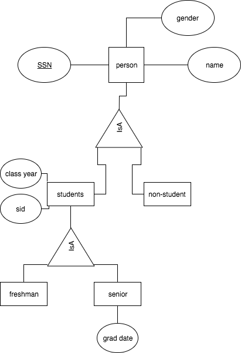
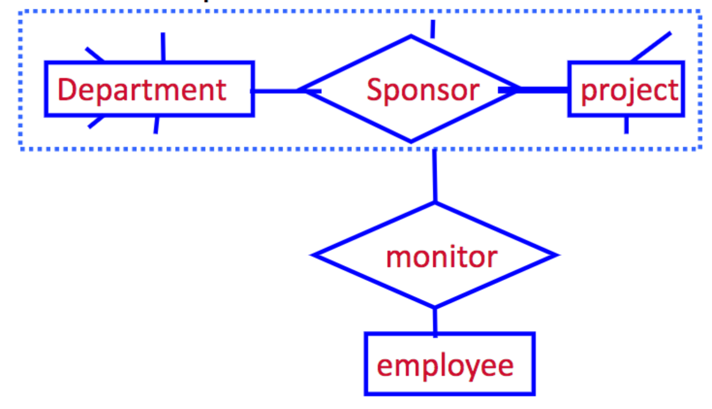

# CS442 - Lecture 4
* Advance ER-diagram
    * Hierachy
    * Aggregation
    * Design Issues of ER diagram

## Enitity Type Hierachies
* One entity type might be subtype of another
    * __Freshman__ is subtype of __Student__
* The ___IsA___ relationship exists between the supertype entity and its subtype entity
* Super top is top of subtypes, triangle is the IsA relation, subtypes are under the triangle.

## Properties of IsA
* __Inheritance__
    * Subtype inherits all attributes of supertype
    * The key of the supertype is the key of the subtype
    * Subtypes can have new attributes
        * Ex: _GraduationDate_ attribute adds to _Senior_
* __Transitivity__
    * _Freshman_ is a subtype of Student, Student is a subtype of Person, so Fresh,am is also a subtype of Person.
    * What is the key of Freshman? __SSN__

## Aggregation
* How to model relationships between relationships?
* Solution: Aggregation–Used to model a relationship involving a relationship set.

## Design Issues
* Design Choices:
    1. Should a concept be modeled as a n <u>entity</u> or an <u>attribute</u>
    2. Should a concept be <u>modeled</u> as an entity or a <u>relationship?</u>   
    3. Identifying realtionships: <u>Binary or Ternary?</u>
* Rule 1: If the concept allows multiple values, it must be designed as an <u>entity</u>
    * Why> Because the attributes cannot be set-valued
    * Ex. If the students take the same course in different semesters, semester must be an entity
* Rule 2: If the concept allows structure (sub-concepts), it must be designed as an <u>entity</u>
    * Why? Because attribute values are atomic.
    * Ex. if structure (enrollment, holidays, etc.) of semester is important, semester must be modeled as an entity.